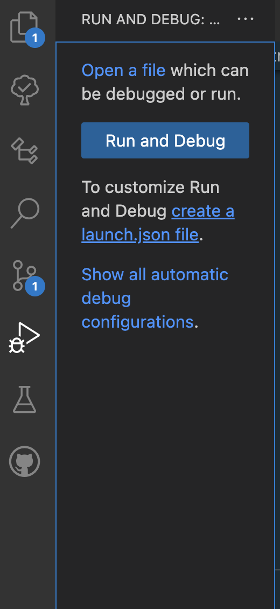

# Debugging

Today we'll talk a bit about debugging your code and take a closer look at Python's `pdb` as well as VSCode's debugger integration.

## Techniques

Before we get into the tools, let's talk about some techniques for debugging your code.

### Print Statements

`print` statements are particularly useful in interpreted languages like Python.
They allow you to see the state of your program at any point in time.

Downsides:
* You have to add them to your code, run it, and remember to remove them.
* They can clutter up your code & output, making it harder to read.
* Debugging code in a loop or frequently-called function can be tedious with a ton of print output to sift through.
* You have to know before running your program what you want to see, if you discover a problem later you have to add more print statements and run it again.


### Logging Statements

Logging statements are similar to print statements, but they are more flexible and can be turned on and off.

By adding logging statements at different levels of severity you can adjust at runtime how much information you want to see.  Typical logging levels are: `DEBUG`, `INFO`, `WARNING`, `ERROR`, and `CRITICAL`.  You can log messages at any of these levels and then set the logging level to control which messages are displayed.

[Python logging documentation](https://docs.python.org/3/howto/logging.html).

These can help with some of the clutter, but are still not an ideal situation.

### Rubber Duck Debugging

This technique is named after a story in the book _The Pragmatic Programmer_ by Andrew Hunt and David Thomas.  The story goes that a programmer would carry around a rubber duck and explain their code to the duck.  Often, in the process of explaining the code, the programmer would realize what was wrong.

Explaining your code to yourself aloud, or a peer can help identify flaws in your logic.

This helps build an important skill & should not be overlooked, but obviously won't solve all your problems.

### ChatGPT Debugging

ChatGPT can be the rubber duck that talks back.  You can use it to explain your code to yourself and see what it thinks you're saying.  If it's not what you expect, you can use that to help you debug your code.

You can of course also show it code snippets and see if it identifies any discrepancies between how you explain your code and how it interprets it. This is a relatively safe way of relying on ChatGPT that leaves you in control of the code that's written but allows you to benefit from the model's abilities.

It will perform best when given a clear description of what the code "should" do, and any errors you are seeing.

Example:

I am trying to write a function that counts the number of times each word appears in a text. I've written this function but it is counting letters for some reason instead of words.  I try to iterate over each word and add it to a dictionary if it's not already there, otherwise increment the count.

```python
def word_count(text, count_dict={}):
    for word in text:
        if word in count_dict:
            count_dict[word] += 1
        else:
            count_dict[word] = 1
```

ChatGPT's response:

The issue with your function is that when you iterate over the text using a for loop, it iterates over each character in the string, not the words. To fix this, you can use the split() method to convert the text into a list of words before iterating.  Here's an example:

```python
def word_count(text, count_dict=None):
    if count_dict is None:
        count_dict = {}
    words = text.split()
    for word in words:
        if word in count_dict:
            count_dict[word] += 1
        else:
            count_dict[word] = 1
    return count_dict
```

I also made a small change to the default value of count_dict. Using a mutable object like a dictionary as a default argument value is not recommended, as it can lead to unexpected behavior. Instead, use None as the default value and initialize the dictionary inside the function if it's not provided.

Pretty great at things like this, but remember to verify the code it writes and watch out for API hallucinations.

## Interactive Debugging

The focus of today is going to be on interactive debugging.  This is a technique that allows you to step through your code and see the state of your program at each step. Used properly, this can save you a lot of time and frustration and help you understand your code at a deeper level.

The interactive debugger we'll be using today is called `pdb`.  It's a command line debugger that comes with Python.

`pdb` may not be the most user friendly debugger, but it's very powerful and it's always available.  (Meaning it comes pre-installed and will be useful if you find yourself debugging on a server or other environment where you can't rely on VSCode.) It's interface is similar to the `gdb` debugger (originally for C and C++ programs) which most other debuggers are based on as well.

To run `pdb` against your program, you can use the `-m` flag to run it as a module.

```bash
python -m pdb my_program.py
```

This will start the debugger and pause execution at the first line of your program.  You can then use the following commands to step through your program.

### PDB Commands

* `n` - step to the next line (aka step over)
* `s` - step into a function call (aka step into)
* `r` - continue until the current function returns (aka step out)
* `c` - continue until the next breakpoint
* `l` - list the current line of code
* `p` - print the value of a variable
* `q` - quit the debugger

#### PDB Demo

```
$ python -m pdb debugging/example1.py
```

### Breakpoints

You can set a breakpoint in your code by adding the following line:

```python
breakpoint()
```

(Older code may use `import pdb; pdb.set_trace()` instead.)

This will pause execution at that point and allow you to step through your code.

#### Breakpoint Demo

### VSCode Debugger

VSCode has a built in debugger that can be used to step through your code.  It's a bit more user friendly than `pdb` and it's integrated into the editor.

To use it, you'll need to add a `launch.json` file to your project.  This file tells VSCode how to run your program and what to do when you start debugging.

You can create a `launch.json` file by clicking on the debug icon in the sidebar and then clicking the gear icon to create a new launch configuration.



This will create a `launch.json` file in your `.vscode` directory.  You can then edit this file to configure your debugger.

Here's an example `launch.json` file:

```json
{
    "version": "0.2.0",
    "configurations": [
        {
            "name": "Python: Current File",   // this is the name that will show up in the dropdown
            "type": "python",
            "request": "launch",
            "program": "${file}",             // this tells VSCode to run the current file
            "arguments": ["arg1", "arg2"],    // if your program requires arguments you'll need to add this
            "console": "integratedTerminal",
            "justMyCode": true                  // this tells VSCode to not step into external libraries
        }
    ]
}
```

#### VSCode Debugger Demo
